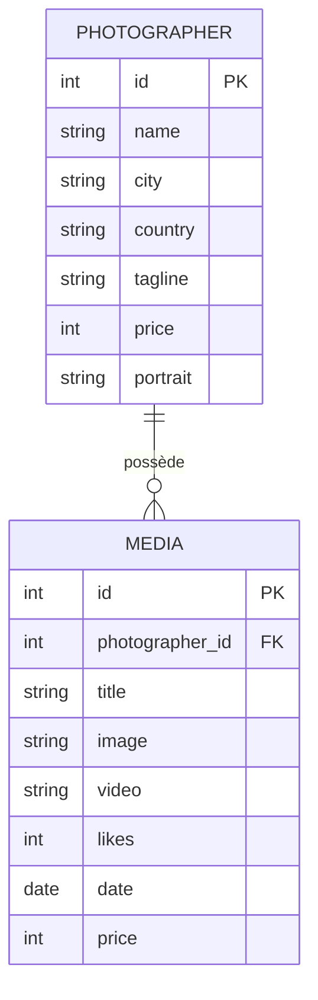

# P3 Développeur fullstack (FishEye) - Option PHP

Ce dépôt contient le starter kit du projet FishEye pour les étudiants ayant choisi l'option PHP.
Vous y trouverez : 
- un fichier `script.sql` permettant de créer votre base de données et d'y peupler des données. Importez-le dans PHPMyAdmin.
- un dossier `assets` à placer dans le backend que vous créerez. Ce dossier contient toutes les images et vidéos liées aux données fournies dans le fichier précédent.

## Modèle de données

L'API repose sur deux tables : `photographer` et `media`. Un photographe possède plusieurs médias (photos ou vidéos), chaque média étant rattaché à un unique photographe via la clé étrangère `photographer_id`.

